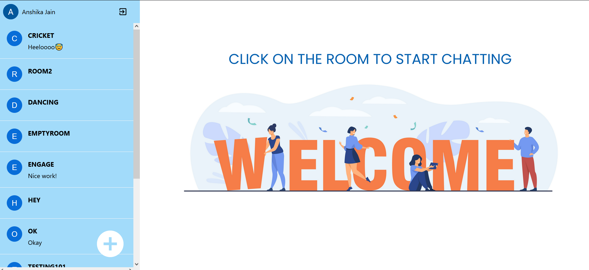

# MICROSOFT ENGAGE | WeConnect

#### One stop solution to connect with your peers over text and through Video calls!

_____________________________________________________________________________________________________

## Features : 
1. ### **Authentication** -
    - When the user opens this application, he is prompted to sign-in through his Google account if he already has a Google account, otherwise he will be required to go and sign-up using Google. 
    - The authentication is achieved using Firebase Google Auth. Firebase Authentication provides backend services, easy-to-use SDKs, and ready-made UI libraries to authenticate users to your app. It supports authentication using passwords, phone numbers, popular federated identity providers like Google, Facebook and Twitter, and more.
    ####

2. ### **Chat** -
    - Once the user is signed in, he will be able to view different groups, where he can go and connect with people. 
    - This application also enables people to create new rooms as per their requirement. They can ask people to come and talk in the same room. 
    - To join an existing conversation, all they have to do and click on the room they want to join. The users can see the existing conversations and can continue to that.
    - To create a new room, they are required to click on the plus sign and enter the room name of their choice, and boom a new room will be created.
    - Along with text messages, they can also send emojis, which adds life to the conversation.
    ####

3. ### **VideoCall** -
    - Instantly go from group chat to video conference with the touch of a button.
    - Make meetings more personal and encourage teamwork when you virtually meet face-to-face. Meet in any situation, whether you’re calling one-on-one, delivering a sales pitch, hosting a team training, or running a company-wide town hall.
    - Click on the video call button present on the top of the room.
    - Each room has its own video room created and stored in the database, where all the meetings are hosted for a particular room.
    - The users can join in the meeting, turn on and off their cameras, mute and unmute themselves.
    - They can even present their screens in case they want to present something.
    - There is also a feature to chat. All those who are present in the meeting can write their thoughts and have a conversation in the chat box. The amazing thing about this feature is that they can resume their conversation even after the meeting ends. YES! THAT’S RIGHT! They can see their messages after the meeting as well.
    ####

## TECHSTACK USED :

**FRONTEND** - ReactJS

**BACKEND** - Firebase

**LIBRARY** - Daily Javascript

## HOW TO RUN THIS APP LOCALLY

1. Clone this repository on your local computer.
2. Open the terminal and navigate to the folder in which you have cloned this project.
3. Run **npm i**, it will install the essential dependencies.
4. Run **npm start**, and go to **http://localhost:3000** on your browser.
5. Enjoy